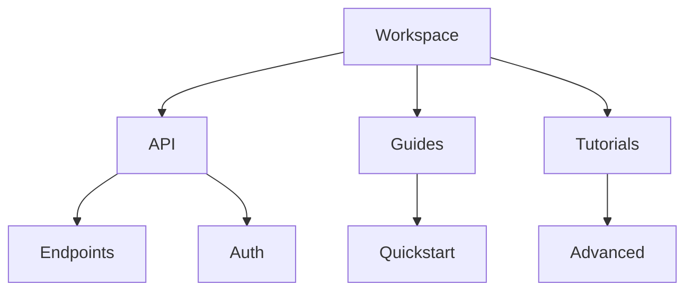

## Overview

Unseen provides powerful tools to organize, collaborate on, and publish your project documentation. You create structured spaces with folders, share content securely, search efficiently, track changes, and export in multiple formats. These features work together to streamline your workflow.

<Columns cols={3}>
  <Card title="Document Structuring" icon="folder" href="#document-structuring">
    Organize content with nested folders and intuitive navigation.
  </Card>
  <Card title="Collaboration" icon="users" href="#collaboration">
    Share documents with teams and control access levels.
  </Card>
  <Card title="Search Tools" icon="search" href="#search">
    Find content quickly with advanced filtering.
  </Card>
  <Card title="Version History" icon="git-branch" href="#version-history">
    Track revisions and restore previous versions.
  </Card>
  <Card title="Export Options" icon="download" href="#export">
    Publish to various formats for distribution.
  </Card>
</Columns>

<Callout kind="tip">
  Start by creating a new folder in your Unseen workspace to structure your docs.
</Callout>

## Document Structuring and Folders

You build hierarchical structures using folders to group related documents. Create nested folders for categories like `api/`, `guides/`, and `tutorials/`. Drag and drop to reorganize, and use tags for cross-folder organization.



This setup keeps your documentation scalable.

## Collaboration and Sharing Options

Invite team members and set permissions. Choose from public links, private shares, or role-based access.

<Tabs>
  <Tab title="Public Link" icon="globe">
    Generate a shareable URL for read-only access.

    ```
    https://docs.unseen.com/project/public-guide
    ```

    Anyone with the link views the document.
  </Tab>
  <Tab title="Team Invite" icon="users">
    Add users by email with edit permissions.

    <ParamField path="userId" param-type="string" required="true">
      Unique user identifier.
    </ParamField>

    <ParamField path="role" param-type="string" required="false">
      Options: `viewer`, `editor`, `admin`.
    </ParamField>
  </Tab>
  <Tab title="Embed" icon="code">
    Embed documents in your site.

    ```html
    <iframe src="https://docs.unseen.com/embed/project-guide" width="100%" height="600"></iframe>
    ```
  </Tab>
</Tabs>

## Search and Filtering Tools

Search across all documents with full-text queries. Filter by folder, tag, or date. Advanced operators like `tag:api` or `folder:guides` refine results.

| Filter Type | Example Query | Result |
|-------------|---------------|--------|
| Keyword     | `authentication` | All docs mentioning auth |
| Tag         | `tag:api`     | API-tagged content |
| Folder      | `folder:guides` | Guides folder only |
| Date        | `modified:>2024-01-01` | Recent changes |

## Version History and Revisions

Unseen automatically saves versions. View, compare, and restore any point in time.

<Steps>
  <Step title="View History" icon="clock">
    Open a document and click the history icon.
  </Step>
  <Step title="Compare Versions" icon="git-compare">
    Select two versions to see diffs.
  </Step>
  <Step title="Restore" icon="refresh-cw">
    Click restore on any version.
  </Step>
</Steps>

<Expandable title="Advanced Revision Management" default-open="false">
  Use the API for programmatic access:

  <CodeGroup tabs="JavaScript,Python">
  ```javascript
  const revisions = await unseen.docs.getRevisions('docId');
  console.log(revisions);
  ```
  ```python
  import unseen
  revisions = unseen.docs.get_revisions('docId')
  print(revisions)
  ```
  </CodeGroup>
</Expandable>

## Export and Publishing Capabilities

Export to Markdown, PDF, or HTML. Publish directly to GitHub or custom hosts.

<CodeGroup tabs="Markdown,PDF,HTML">
```markdown
# My Guide
Content here.
```
```json
{
  "format": "pdf",
  "options": {
    "includeImages": true
  }
}
```
```html
<!DOCTYPE html>
<html>
<head><title>Exported Doc</title></head>
<body><!-- Content --></body>
</html>
```
</CodeGroup>

<Callout kind="success">
  Exports preserve folder structure and links.
</Callout>

## Next Steps

<Columns cols={2}>
  <Card title="Quickstart" icon="rocket" href="/quickstart">
    Set up your first workspace.
  </Card>
  <Card title="API Reference" icon="api" href="/api">
    Integrate Unseen programmatically.
  </Card>
</Columns>