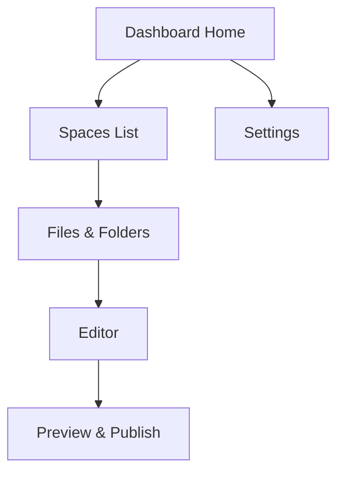

## Prerequisites

<Callout kind="info">

Before starting, ensure you have:
- A modern web browser (Chrome, Firefox, or Safari)
- An email address for account verification
- Optional: GitHub account for easy project imports

</Callout>

## Create Your Unseen Account

Follow these steps to sign up and verify your account.

<Steps>
  <Step title="Visit the Dashboard" icon="globe">
    Open your browser and go to `https://dashboard.unseen.com`.
  </Step>
  <Step title="Sign Up" icon="user-plus">
    Click **Sign Up** and enter your email, password, and workspace name.
  </Step>
  <Step title="Verify Email" icon="mail">
    Check your inbox for a verification email from Unseen and click the link.
  </Step>
  <Step title="Complete Onboarding" icon="check-circle">
    Log in and complete the short onboarding survey to access your dashboard.
  </Step>
</Steps>

## Set Up Your Default Documentation Space

Once logged in, create your first documentation space.

<Steps>
  <Step title="Create New Space" icon="plus">
    From the dashboard, click **New Space** and select **Documentation**.
  </Step>
  <Step title="Name Your Space" icon="edit-3">
    Enter a name like `My Project Docs` and choose a description.
  </Step>
  <Step title="Set Permissions" icon="shield">
    Configure access: public, private, or invite team members by email.
  </Step>
  <Step title="Save and Publish" icon="save">
    Click **Create Space** to generate your default documentation hub.
  </Step>
</Steps>

## Import Initial Project Files

Import your existing files using one of these methods.

<Tabs>
  <Tab title="Drag & Drop" icon="upload">
    <Steps>
      <Step title="Open Files Panel">
        In your space, click the **Files** tab on the left sidebar.
      </Step>
      <Step title="Upload Files">
        Drag Markdown (`.mdx`, `.md`), images, or JSON files into the upload zone.
      </Step>
    </Steps>
  </Tab>
  <Tab title="GitHub Repo" icon="github">
    <Steps>
      <Step title="Connect GitHub">
        Go to **Integrations > GitHub** and authorize Unseen.
      </Step>
      <Step title="Import Repo">
        Paste your repo URL (e.g., `https://github.com/user/my-project`) and select branches.
      </Step>
    </Steps>
  </Tab>
  <Tab title="CLI Import" icon="terminal">
````bash
npx unseen-cli import --space="My Project Docs" --path="./docs" --api-key="YOUR_API_KEY"
````
    Use the Unseen CLI for bulk imports from local directories. Install with `npm install -g unseen-cli`.
  </Tab>
</Tabs>

## Navigate the Dashboard Interface

The Unseen dashboard provides an intuitive interface for managing your docs.



Key areas:
- **Spaces List**: Switch between documentation spaces.
- **Editor**: Real-time MDX editing with live preview.
- **Publish**: One-click deployment to custom domains.

## Basic Editing and Saving Workflows

Edit files directly in the browser-based editor.

<CodeGroup tabs="MDX,Markdown">
````mdx
## Welcome to Unseen

This is your first document.

<Callout kind="tip">
Start editing here!
</Callout>
````
````markdown
## Welcome to Unseen

This is your first document.

> Start editing here!
````
</CodeGroup>

To save:
1. Changes auto-save every 10 seconds.
2. Use **Ctrl+S** (`Cmd+S` on macOS) for manual saves.
3. Preview updates in real-time on the right panel.

<Callout kind="tip">
Use version history in the **Revisions** tab to revert changes anytime.
</Callout>

## Next Steps

<Columns cols={3}>
  <Card title="Introduction" icon="book-open" href="/introduction">
    Learn core Unseen concepts and features.
  </Card>
  <Card title="Authentication" icon="lock" href="/authentication">
    Secure your spaces with API keys and teams.
  </Card>
  <Card title="Advanced Editing" icon="edit-3" href="/guides/editing">
    Master MDX components and custom themes.
  </Card>
</Columns>